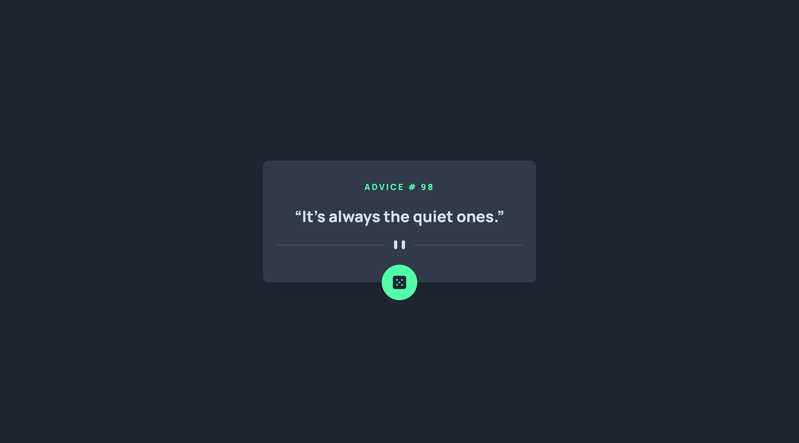
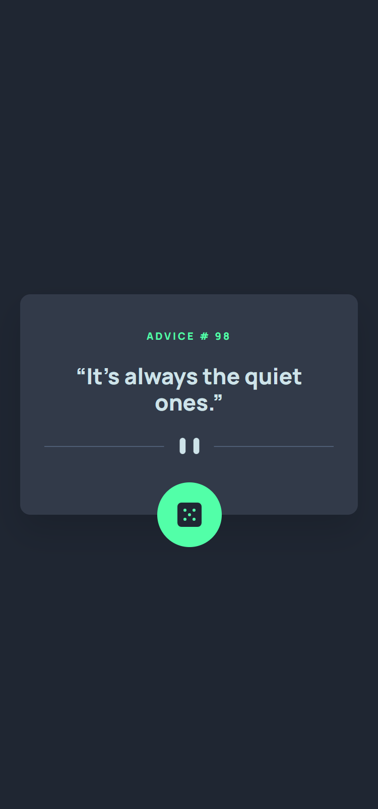

# Frontend Mentor - Advice generator app solution

## Table of contents

- [Overview](#overview)
  - [The challenge](#the-challenge)
  - [Screenshots](#screenshots)
  - [Links](#links)
- [My process](#my-process)
  - [Built with](#built-with)
- [Author](#author)

## Overview

### The challenge

Users should be able to:

- View the optimal layout for the app depending on their device's screen size
- See hover states for all interactive elements on the page
- Generate a new piece of advice by clicking the dice icon

### Screenshots

| Desktop View                     | Mobile View                    |
| -------------------------------- | ------------------------------ |
|  |  |

### Links

- Solution URL: [Advice Generator App](https://frontendmentor.io/)
- Live Site URL: [tobiii-aga.vercel.app](https://tobiii-aga.vercel.app/)

## My process

### Built with

- Semantic HTML5 markup
- CSS custom properties
- Mobile-first workflow

## Author

- Website - [Emmanuel Adeyeye](https://tobiii.vercel.app)
- Frontend Mentor - [@purrrplelipton](https://www.frontendmentor.io/profile/purrrplelipton)
- Twitter - [@purrrplelipton](https://www.twitter.com/purrrplelipton)
